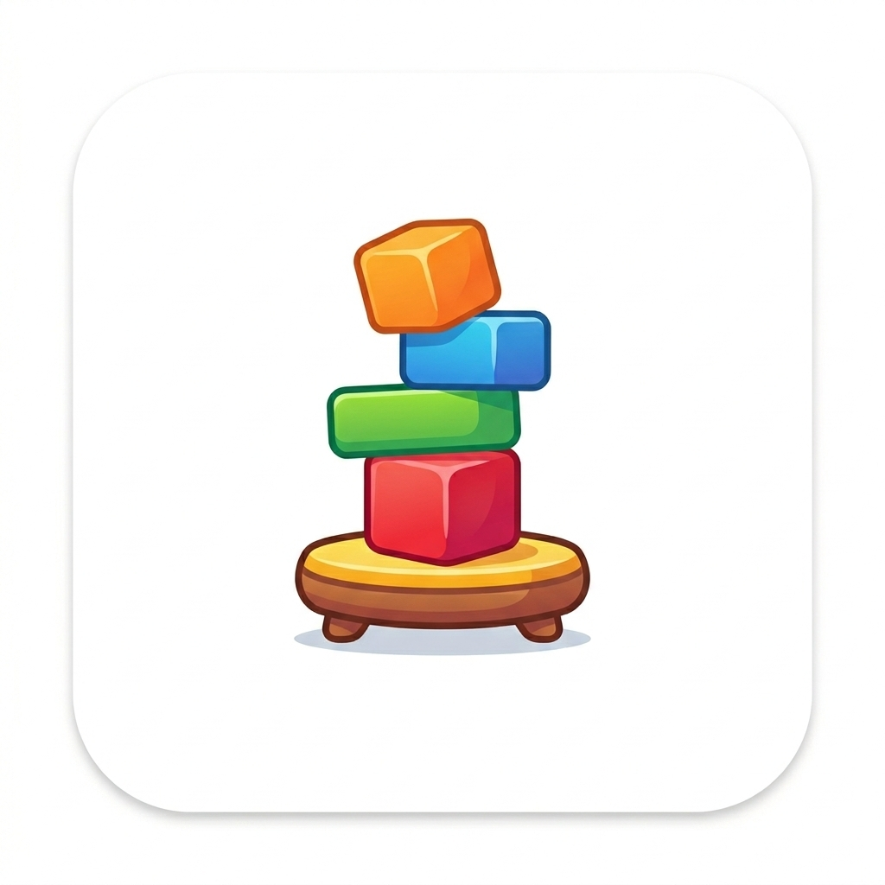

# 🔧 Tower Balance v1.1.0 - Update Instructions

## קבצים שנוצרו

### קבצים עיקריים:
1. **index.html** - קובץ המשחק המקורי (כבר קיים, נדרש עדכון קל)
2. **manifest.json** - מניפסט PWA מעודכן ✅
3. **version.json** - קובץ גרסה ✅
4. **sw.js** - Service Worker מעודכן ✅
5. **logo.png** - לוגו ראשי (1024x1024) ✅
6. **icons/** - תיקייה עם אייקונים בגדלים שונים ✅

### קבצים חדשים (מערכות):
7. **version-manager.js** - מנהל גרסאות דינמי ✅
8. **pwa-install-system.js** - מערכת התקנת PWA ✅
9. **app-reset-system.js** - מערכת איפוס אפליקציה ✅

## שינויים נדרשים ב-index.html

### 1. הוספת מטא-טאגים (בתוך `<head>`)

```html
<!-- Apple Touch Icon -->
<link rel="apple-touch-icon" href="./logo.png">
<link rel="apple-touch-icon" sizes="152x152" href="./icons/icon-152x152.png">
<link rel="apple-touch-icon" sizes="192x192" href="./icons/icon-192x192.png">
```

### 2. הוספת סקריפטים לפני סגירת `</body>`

```html
<!-- Version Manager -->
<script src="version-manager.js"></script>

<!-- PWA Install System -->
<script src="pwa-install-system.js"></script>

<!-- App Reset System -->
<script src="app-reset-system.js"></script>
```

### 3. עדכון PhysicsEngine

מצא את השורה (בערך 865):
```javascript
this.COLLAPSE_DEG  = 35;
```

שנה ל:
```javascript
this.COLLAPSE_DEG  = 40;  // Reduced sensitivity - more gameplay time
```

### 4. הוספת אלמנט גרסה (אם לא קיים)

בתוך HUD או בתחתית המסך:
```html
<div id="appVersion" data-app-version style="
    position: fixed;
    bottom: 8px;
    right: 8px;
    font-size: 10px;
    color: rgba(255,255,255,0.4);
    font-family: 'Orbitron', monospace;
    cursor: pointer;
    z-index: 1000;
">v1.1.0</div>
```

### 5. וודא שיש את האלמנטים הבאים ב-HTML

```html
<!-- Install Banner (should exist) -->
<div id="installBanner" class="install-banner">
    <div class="install-content">
        
        <div>
            <strong>התקן את משחק מגדל האיזון</strong>
            <p>גישה מהירה וללא אינטרנט</p>
        </div>
    </div>
    <div class="install-actions">
        <button id="installBtn">התקן</button>
        <button id="installDismissBtn">לא עכשיו</button>
    </div>
</div>

<!-- Reset Modal checkboxes (should exist) -->
<div id="resetModal" class="modal">
    <div class="modal-content">
        <h2>איפוס נתונים</h2>
        <div class="reset-options">
            <label>
                <input type="checkbox" id="keepProgress" checked>
                <span>שמור התקדמות משחק</span>
            </label>
            <label>
                <input type="checkbox" id="keepHighScore" checked>
                <span>שמור שיאים</span>
            </label>
            <label>
                <input type="checkbox" id="keepSettings" checked>
                <span>שמור הגדרות</span>
            </label>
        </div>
        <div class="modal-actions">
            <button id="confirmResetBtn">אפס</button>
            <button id="cancelResetBtn">ביטול</button>
        </div>
    </div>
</div>
```

## בדיקת תקינות

### 1. וודא שכל הקבצים במקום:
```bash
ls -l
# Should see:
# index.html
# manifest.json
# version.json
# sw.js
# logo.png
# icons/
# version-manager.js
# pwa-install-system.js
# app-reset-system.js
```

### 2. בדוק שהשרת פועל:
```bash
python -m http.server 8000
```

### 3. פתח בדפדפן:
```
http://localhost:8000
```

### 4. בדוק ב-Console:
```javascript
// Should see:
[Version] Loaded: 1.1.0
[SW] Service Worker loaded
[PWA] beforeinstallprompt event captured (after 3 seconds)
```

### 5. בדוק פונקציונליות:

#### PWA Install:
- אמור להופיע באנר התקנה אחרי 3 שניות
- לחיצה על "התקן" אמורה להתקין את האפליקציה
- לחיצה על "לא עכשיו" אמורה להסתיר את הבאנר

#### Hard Reset:
- לחץ 5 פעמים על מספר הגרסה (בפינה)
- אמור להופיע דיאלוג אישור
- לאחר אישור - איפוס מלא וטעינה מחדש

#### Selective Reset:
- פתח תפריט → הגדרות → איפוס נתונים
- סמן מה לשמור
- לחץ "אפס"
- אמור לשמור רק את מה שסומן

#### Physics:
- המגדל אמור להיות פחות רגיש
- זמן משחק ארוך יותר לפני קריסה
- זווית קריסה: 40° (במקום 35°)

#### Floor Selection:
- ניתן להציב דמות בכל קומה
- Ghost preview מראה אם המקום תפוס
- דמויות מתמקמות אוטומטית בחריץ הפנוי

## שיפורי CSS נדרשים

הוסף ל-CSS (אם לא קיים):

```css
/* Install Banner */
.install-banner {
    position: fixed;
    bottom: -200px;
    left: 0;
    right: 0;
    background: rgba(26, 31, 58, 0.95);
    backdrop-filter: blur(20px);
    padding: 20px;
    border-top: 2px solid var(--primary);
    box-shadow: 0 -8px 32px rgba(0, 0, 0, 0.5);
    transition: bottom 0.4s ease-out;
    z-index: 1000;
    display: flex;
    align-items: center;
    justify-content: space-between;
    gap: 20px;
}

.install-banner.show {
    bottom: 0;
}

.install-content {
    display: flex;
    align-items: center;
    gap: 15px;
    flex: 1;
}

.install-content img {
    width: 48px;
    height: 48px;
    border-radius: 12px;
}

.install-actions {
    display: flex;
    gap: 10px;
}

.install-actions button {
    padding: 10px 20px;
    border: none;
    border-radius: 8px;
    font-family: 'Rajdhani', sans-serif;
    font-size: 14px;
    font-weight: 600;
    cursor: pointer;
    transition: all 0.3s ease;
}

#installBtn {
    background: linear-gradient(135deg, var(--primary), var(--secondary));
    color: white;
}

#installBtn:hover {
    transform: translateY(-2px);
    box-shadow: 0 4px 12px rgba(255, 107, 53, 0.4);
}

#installDismissBtn {
    background: transparent;
    color: var(--text-dim);
    border: 1px solid rgba(255, 255, 255, 0.2);
}

/* Version Display */
#appVersion {
    position: fixed;
    bottom: 8px;
    right: 8px;
    font-size: 10px;
    color: rgba(255, 255, 255, 0.4);
    font-family: 'Orbitron', monospace;
    cursor: pointer;
    z-index: 1000;
    transition: all 0.3s ease;
}

#appVersion:hover {
    color: rgba(255, 255, 255, 0.8);
    transform: scale(1.1);
}

/* Reset Modal Options */
.reset-options {
    display: flex;
    flex-direction: column;
    gap: 15px;
    margin: 20px 0;
}

.reset-options label {
    display: flex;
    align-items: center;
    gap: 10px;
    cursor: pointer;
    padding: 10px;
    border-radius: 8px;
    transition: background 0.3s ease;
}

.reset-options label:hover {
    background: rgba(255, 107, 53, 0.1);
}

.reset-options input[type="checkbox"] {
    width: 20px;
    height: 20px;
    cursor: pointer;
}
```

## בעיות נפוצות ופתרונות

### הבאנר לא מופיע:
- בדוק שה-manifest.json קיים
- בדוק ש-Service Worker רשום
- נסה במצב incognito
- בדוק ש-HTTPS או localhost

### גרסה לא מתעדכנת:
- רענן עם Ctrl+F5
- נקה cache
- בדוק ש-version.json נטען
- בדוק Console לשגיאות

### Hard Reset לא עובד:
- וודא שהאלמנט #appVersion קיים
- בדוק שה-script app-reset-system.js נטען
- נסה ללחוץ מהר יותר (5 לחיצות תוך 2 שניות)

### איפוס סלקטיבי לא עובד:
- וודא שהצ'קבוקסים קיימים
- בדוק שהפונקציה closeModal קיימת
- בדוק Console לשגיאות

## סיכום השינויים

✅ **PWA מלא** - התקנה, offline, icons
✅ **מערכת איפוס** - Hard + Selective
✅ **ניהול גרסאות** - דינמי מ-JSON
✅ **פיזיקה משופרת** - רגישות מופחתת
✅ **בחירת קומה** - חופש מלא
✅ **לוגו מלא** - כל הגדלים
✅ **תיעוד מלא** - README מפורט

## הצלחה! 🎉

האפליקציה שלך עכשיו:
- מתקינה כ-PWA מלא ✨
- מאפשרת איפוס גמיש 🔄
- עוקבת אחרי גרסאות 📊
- פחות רגישה ויותר כיפית 🎮
- נראית מקצועית עם לוגו 🎨

---

**נהנה מהעדכון? שתף עם חברים! 🚀**
